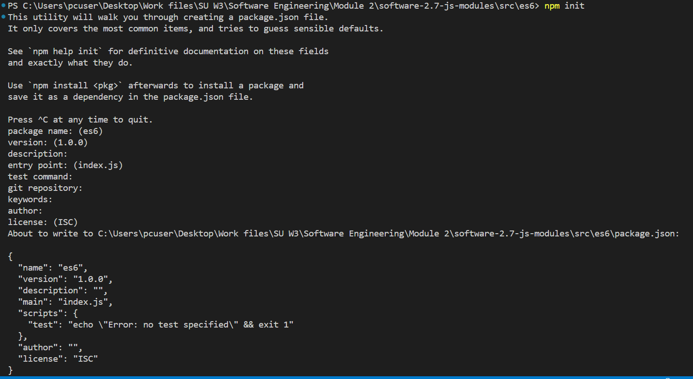

## Brief

### Preparation

Make sure that students have installed nvm and npm for this lesson.

### Lesson Overview

This lesson focuses on modularization, learners would learn how to create small modules that can be used by other files. There are two main approaches for this, CommonJS and ES6. The learners will also try using npm to install modules as needed.

---

## Part 1 - Modularization

JavaScript programs started off pretty small — most of its usage in the early days was to provide interactivity to web pages, so large scripts were not needed. 

Now, complete applications are being run in browsers with JavaScript, as well as  used in other contexts (Node.js, for example).

Therefore, there is a need to split JavaScript programs up into separate modules that can be imported when needed. 

There are a number of libraries and frameworks that enable module usage (ex. CommonJS), and NodeJS has this modularization capability as well.

### What is a module?

A module is just a bit of code encapsulated in a file, and exported to another file. 

Modules focus on a part of functionality and remain loosely coupled with other files in an application. 

This is because there are no global or shared variables between modules, as they only communicate via the module.exports object. 

Any code that needs to be accessible in another file can be a module.

---

## Part 2 - CommonJS

CommonJS is a module formatting system. It is a standard for structuring and organizing JavaScript code. 

CommonJS wraps each module in a function called ‘require’, and includes an object called `module.exports`, which exports code for availability to be required by other modules. 

All that needs to be done is to add the necessary dependencies to the `exports` object and use `require` for the required module in the dependent file. 

### Exporting Objects

Objects can be exported using the module.exports. Note that you must specify `./` as a path of root folder to import a local module.

```js
// person.js
module.exports = {
    name: "Brandon Smith",
    age: 19
}

// index.js
//Note that the file is being required and no extension is needed.
const person = require("./person"); //Objects can be created from the exported module.
const {name, age} = require("./person"); //Destructuring can also be done
console.log(person.name);
console.log(age);
```
### Exporting functions

Functions can also be exported using the module.export.

```js
//action.js
const greet = (name) => {
    console.log(`Hello ${name}! Welcome from the action module`);
}

module.exports = greet;

//index.js
const greetFromModule = require("./action");
greetFromModule("Alice");
```

*Note: Best practice is to put all the module requires at the top of the script.*

---

## Part 3 - ES6 Modules

ES6 modules need a package.json file in order to use the modularization. This is to help identify that the folder is a package for an application.

To create a package.json file, open a terminal and type the command `npm init` and provide the necessary information and hit "Enter" for the prompts. After which, a package.json file will be created.




After creating the package.json file, add the `type:module` property to make the app know that it uses ES6 modules. Also add a start script to run the application.

```json
...
  "main": "index.js",
  "type": "module", //add this
  "scripts": {
    "test": "echo \"Error: no test specified\" && exit 1",
    "start": "node index.js" //add this
  },
...
```

Then you can proceed with import and export as usual.

### Exporting files
```js
//name.js
const personName = "Brandon";

export const pet = {
    name: "Cheddar",
    species: "cat",
    breed: "Bengal / Persian",
    color: "orange"
};

export const greet = (name) => {
    console.log(`Hello from name.js, ${name}!`);
}

// The default export is the export that is seen by the importing file without the need for destructuring.
export default personName;
```

### Importing files

```js
//index.js
import personName, {pet, greet} from "./name.js";
//All non-default exports needs to be destructured from the file.

console.log(personName);
console.log(pet.name, pet.breed);
greet("Monika");
```

### Running a package

To run the package, the start script of package.json is needed, and to run the script, the command `npm run <scriptName>` is used.

Ex.
`npm run start`

---

## Part 3 - Node package manager / NPM

As seen in the last part, the commands `npm init` and `npm start` are used. These are part of npm, which is the node package manager. 

Node package manager or NPM allows developers to create Node.js applications as well as get packages from the repository to use for the applications. There are a number of different packages for different functions and they can be found in the [npmjs](https://www.npmjs.com/) website.

To install a package from npmjs, the command `npm install` is used along with the package name.

Once the package is installed, a new folder called `node_modules` will appear and all the dependencies will be there.

Ex.
`npm install lodash`

Lodash is a JavaScript library that works with arrays, strings, objects, numbers, and provides various inbuilt functions and uses a functional programming approach.

```js
//index.js
...
import _ from "lodash";
...
const nums = _.range(1, 9);
console.log(nums);
```

### .gitignore

Node package dependencies can be large (it can reach up to 200Mb) and numerous (Can reach up to 1000 files). As such, pushing the node_modules folder is not practical.

To prevent pushing of node_modules, a .gitignore file can be used. The file contains all the files and directories not to be pushed to the remote repository.

Create a .gitignore in the directory where the node_modules directory is and put in the file "node_modules". This tells git not to push the node_modules to remote repositories.

